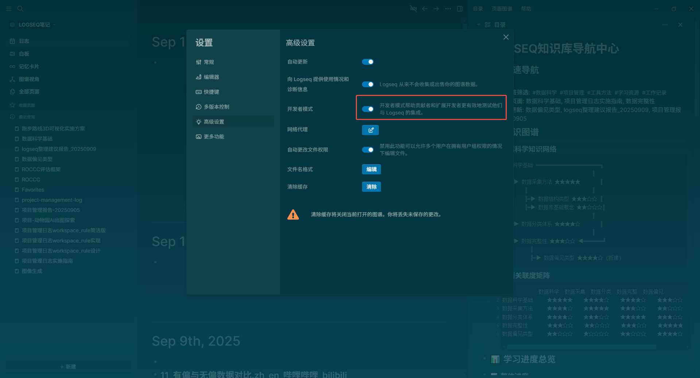
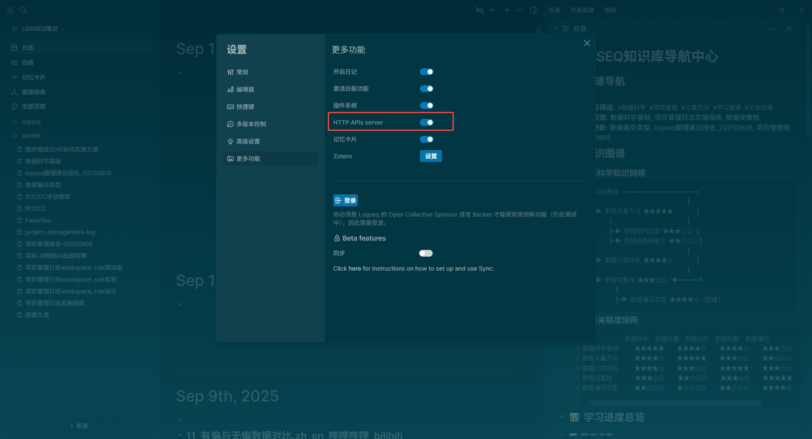
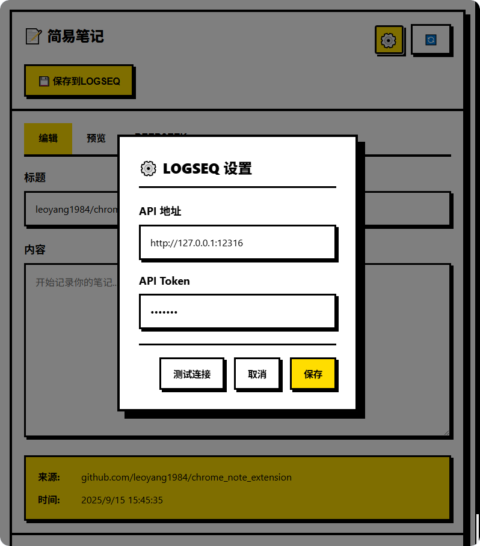
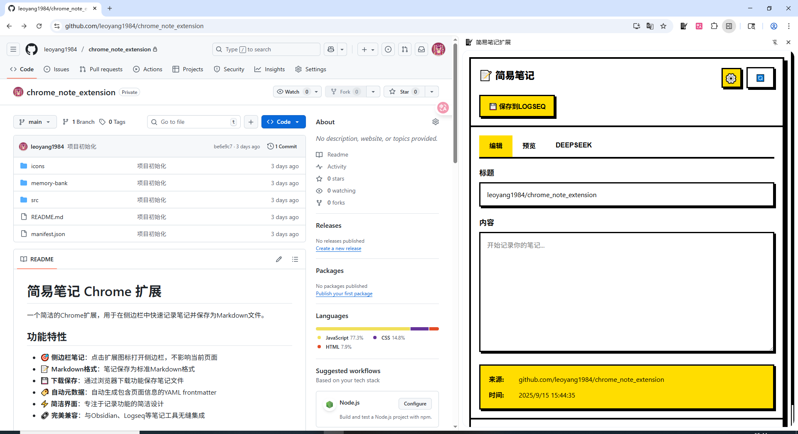

# 简易笔记 Chrome 扩展

一个简洁的Chrome扩展，用于在侧边栏中快速记录笔记并保存到Logseq，同时提供Deepseek AI助手功能。

## 功能特性

- 🎯 **侧边栏笔记**：点击扩展图标打开侧边栏，不影响当前页面
- 📝 **Markdown格式**：笔记保存为Markdown格式并同步到logseq
- 🤖 **AI助手**：内置Deepseek AI助手，提供翻译和问答功能
- 🏷️ **自动元数据**：自动生成包含页面信息的YAML frontmatter
- ⚡ **简洁界面**：编辑、预览、AI助手三视图切换
- 🔗 **Logseq集成**：通过API直接同步到Logseq笔记系统

## 安装和使用

### 开发者模式安装

1. 打开Chrome浏览器，进入扩展管理页面：`chrome://extensions/`
2. 开启右上角的"开发者模式"开关
3. 点击"加载已解压的扩展程序"按钮
4. 选择本项目文件夹
5. 扩展将被加载并可以使用

### 使用方法

1. 点击扩展图标打开侧边栏
2. 输入笔记标题和内容
3. 点击"保存到LOGSEQ"
4. 笔记将保存到logseq中

## 文件结构

```
chrome-note-extension/
├── manifest.json          # 扩展配置文件
├── icons/                 # 扩展图标
│   ├── icon16.png        # 16x16图标
│   ├── icon32.png        # 32x32图标
│   ├── icon48.png        # 48x48图标
│   └── icon128.png       # 128x128图标
├── src/                  # 源代码目录
│   ├── background.js     # 后台服务工作者
│   ├── sidepanel.html    # 侧边栏界面
│   ├── sidepanel.css     # 侧边栏样式
│   ├── sidepanel.js      # 侧边栏主逻辑
│   ├── utils.js          # 工具函数模块
│   ├── deepseek.js       # Deepseek AI助手模块
│   ├── logseqService.js  # Logseq服务模块
│   └── marked.min.js     # Markdown解析库
├── 截图/                 # 使用说明截图
│   ├── 开启开发者模式.png
│   ├── 打开api-server.png
│   ├── logseq-api设置.png
│   └── 界面截图1.png
├── memory-bank/          # 项目文档
│   ├── projectbrief.md   # 项目概要
│   ├── productContext.md # 产品上下文
│   ├── activeContext.md  # 当前工作焦点
│   ├── systemPatterns.md # 系统架构
│   ├── techContext.md    # 技术上下文
│   └── progress.md       # 进度跟踪
└── README.md            # 说明文档
```

## 技术栈

- Chrome Extensions API (Manifest V3)
- HTML5/CSS3/JavaScript (ES6+)
- 浏览器下载API
- Markdown格式

## 浏览器要求

- Chrome 88+ (支持Manifest V3)
- 所有现代浏览器都支持下载功能

## Logseq 集成配置

### 1. Logseq 开发者模式设置

首先需要在Logseq中开启开发者模式：



### 2. 开启 API Server

在Logseq中开启API Server，这是插件能够将笔记传到Logseq的前提：



### 3. 插件API设置

在Chrome扩展中设置API地址和API Token，确保与Logseq中的设置一致：



**设置步骤：**
1. 点击扩展界面右上角的设置按钮(⚙️)
2. 输入Logseq API地址（默认：http://127.0.0.1:12316）
3. 输入Logseq API Token（与Logseq中设置的Token一致）
4. 点击"测试连接"验证配置
5. 保存设置

### 4. 界面概览

扩展提供简洁的三视图界面：编辑、预览、Deepseek AI助手：



## Deepseek AI 助手使用

扩展内置Deepseek AI助手，提供以下功能：

- **翻译功能**：快速翻译英文内容
- **问答助手**：回答各种问题
- **内容优化**：帮助改进笔记内容

**使用方法：**
1. 点击"DeepSeek"标签切换到AI助手视图
2. 在输入框中输入您的问题或需要翻译的内容
3. 按Enter发送或点击发送按钮
4. AI助手会即时回复

**注意**：Deepseek功能需要用户自行配置API密钥。

## 开发说明

本项目采用模块化架构设计，代码结构清晰：

1. **background.js** - 处理扩展核心逻辑和消息通信
2. **sidepanel.js** - 侧边栏界面逻辑和用户交互
3. **utils.js** - 工具函数和辅助方法
4. **deepseek.js** - Deepseek AI助手功能模块
5. **logseqService.js** - Logseq API服务模块

## 许可证

MIT License
